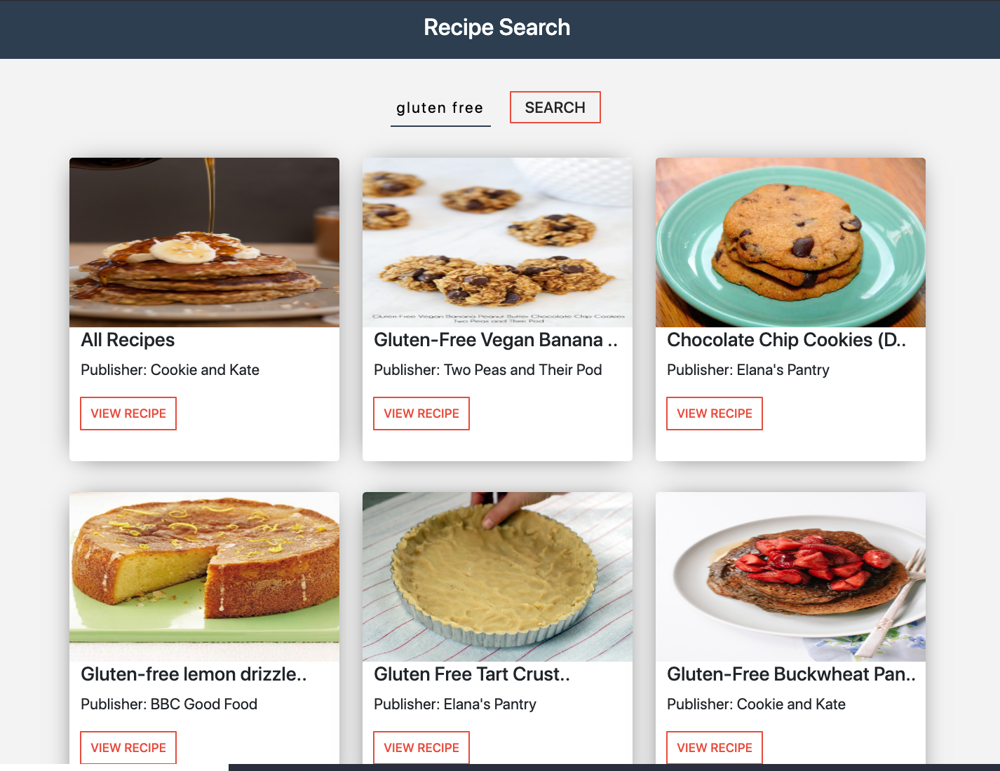
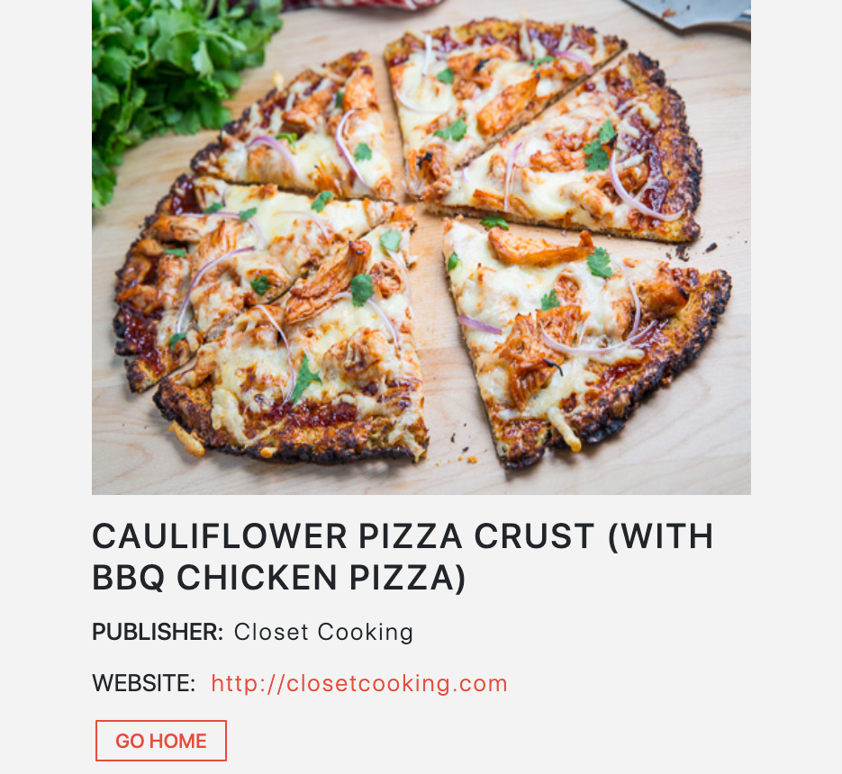

## Recipe Finder ##

Uses Food2Fork's Recipe API to query recipes using user's search. Built using React.

## Build Status ##

This project is mainly for the learning experience and getting more comfortable using API's with React applications. Credits go to Hamza Mirza for the idea and tutorial on how to execute such a project.  

## Technology and frameworks used ##

**Built with**
  * ReactJS
  * HTML + CSS
  * [RecipeAPI](https://www.food2fork.com/about/api)
  
## Installation ## 

1. Clone this repository. 
2. Navigate to the directory from the command line then run 'npm start'.

## How To Use ## 

1. Type in a food/drink recipe that you're curious about (i.e. "pizza") in the text fields. 
2. Hit the 'Search' button.
3. Choose a recipe that looks good.
4. Repeat and enjoy!

## Credits ## 

Credits for the recipe fetching API tutorial and CSS styling go to Hamza Mirza. His tutorials on YouTube are extremely detailed and helpful for students like me who are new to programming React applications. 

